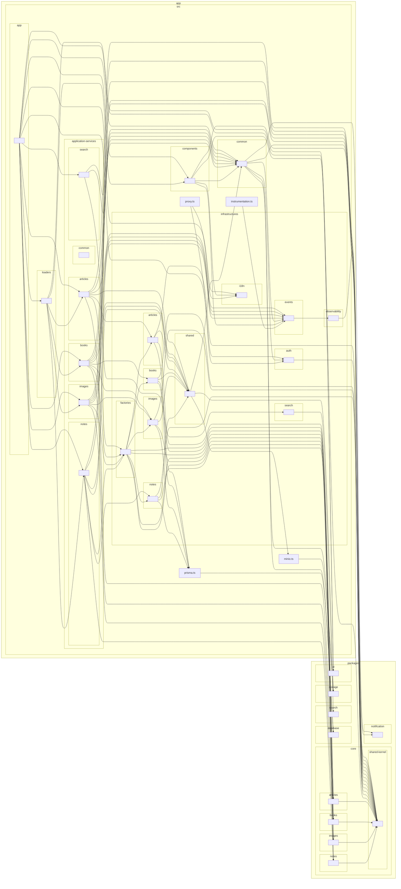

```mermaid
flowchart LR

subgraph app["app"]
  subgraph app_src["src"]
    subgraph app_src_app["app"]
      app_src_app_[" "]
    end
    subgraph app_src_application_services["application-services"]
      subgraph app_src_application_services_articles["articles"]
        app_src_application_services_articles_[" "]
      end
      subgraph app_src_application_services_books["books"]
        app_src_application_services_books_[" "]
      end
      subgraph app_src_application_services_common["common"]
        app_src_application_services_common_[" "]
      end
      subgraph app_src_application_services_images["images"]
        app_src_application_services_images_[" "]
      end
      subgraph app_src_application_services_notes["notes"]
        app_src_application_services_notes_[" "]
      end
      subgraph app_src_application_services_search["search"]
        app_src_application_services_search_[" "]
      end
    end
    subgraph app_src_common["common"]
      app_src_common_[" "]
    end
    subgraph app_src_components["components"]
      app_src_components_[" "]
    end
    subgraph app_src_infrastructures["infrastructures"]
      subgraph app_src_infrastructures_articles["articles"]
        app_src_infrastructures_articles_[" "]
      end
      subgraph app_src_infrastructures_auth["auth"]
        app_src_infrastructures_auth_[" "]
      end
      subgraph app_src_infrastructures_books["books"]
        app_src_infrastructures_books_[" "]
      end
      subgraph app_src_infrastructures_events["events"]
        app_src_infrastructures_events_[" "]
      end
      subgraph app_src_infrastructures_factories["factories"]
        app_src_infrastructures_factories_[" "]
      end
      subgraph app_src_infrastructures_i18n["i18n"]
        app_src_infrastructures_i18n_[" "]
      end
      subgraph app_src_infrastructures_images["images"]
        app_src_infrastructures_images_[" "]
      end
      subgraph app_src_infrastructures_notes["notes"]
        app_src_infrastructures_notes_[" "]
      end
      subgraph app_src_infrastructures_observability["observability"]
        app_src_infrastructures_observability_[" "]
      end
      subgraph app_src_infrastructures_search["search"]
        app_src_infrastructures_search_[" "]
      end
      subgraph app_src_infrastructures_shared["shared"]
        app_src_infrastructures_shared_[" "]
      end
    end
    app_src_instrumentation_ts["instrumentation.ts"]
    subgraph app_src_loaders["loaders"]
      app_src_loaders_[" "]
    end
    app_src_minio_ts["minio.ts"]
    app_src_prisma_ts["prisma.ts"]
    app_src_proxy_ts["proxy.ts"]
  end
end
subgraph packages["packages"]
  subgraph packages_core["core"]
    subgraph packages_core_articles["articles"]
      packages_core_articles_[" "]
    end
    subgraph packages_core_books["books"]
      packages_core_books_[" "]
    end
    subgraph packages_core_images["images"]
      packages_core_images_[" "]
    end
    subgraph packages_core_notes["notes"]
      packages_core_notes_[" "]
    end
    subgraph packages_core_shared_kernel["shared-kernel"]
      packages_core_shared_kernel_[" "]
    end
  end
  subgraph packages_database["database"]
    packages_database_[" "]
  end
  subgraph packages_notification["notification"]
    packages_notification_[" "]
  end
  subgraph packages_search["search"]
    packages_search_[" "]
  end
  subgraph packages_storage["storage"]
    packages_storage_[" "]
  end
  subgraph packages_ui["ui"]
    packages_ui_[" "]
  end
end
app_src_app_-->packages_ui_
app_src_app_-->app_src_application_services_articles_
app_src_app_-->app_src_common_
app_src_app_-->app_src_components_
app_src_app_-->app_src_loaders_
app_src_app_-->app_src_application_services_books_
app_src_app_-->app_src_application_services_images_
app_src_app_-->app_src_application_services_notes_
app_src_app_-->app_src_infrastructures_i18n_
app_src_app_-->app_src_application_services_search_
app_src_app_-->app_src_infrastructures_auth_
app_src_application_services_articles_-->app_src_common_
app_src_application_services_articles_-->packages_core_articles_
app_src_application_services_articles_-->app_src_infrastructures_articles_
app_src_application_services_articles_-->app_src_infrastructures_events_
app_src_application_services_articles_-->app_src_infrastructures_factories_
app_src_application_services_articles_-->packages_core_shared_kernel_
app_src_application_services_articles_-->app_src_infrastructures_shared_
app_src_application_services_books_-->app_src_common_
app_src_application_services_books_-->packages_core_books_
app_src_application_services_books_-->app_src_infrastructures_images_
app_src_application_services_books_-->packages_core_shared_kernel_
app_src_application_services_books_-->app_src_infrastructures_books_
app_src_application_services_books_-->app_src_infrastructures_events_
app_src_application_services_books_-->app_src_infrastructures_factories_
app_src_application_services_books_-->app_src_infrastructures_shared_
app_src_application_services_images_-->app_src_common_
app_src_application_services_images_-->packages_core_images_
app_src_application_services_images_-->app_src_infrastructures_images_
app_src_application_services_images_-->app_src_infrastructures_events_
app_src_application_services_images_-->app_src_infrastructures_factories_
app_src_application_services_images_-->app_src_infrastructures_shared_
app_src_application_services_images_-->packages_core_shared_kernel_
app_src_application_services_notes_-->app_src_common_
app_src_application_services_notes_-->packages_core_notes_
app_src_application_services_notes_-->app_src_infrastructures_events_
app_src_application_services_notes_-->app_src_infrastructures_factories_
app_src_application_services_notes_-->app_src_infrastructures_notes_
app_src_application_services_notes_-->packages_core_shared_kernel_
app_src_application_services_notes_-->app_src_infrastructures_shared_
app_src_application_services_search_-->app_src_common_
app_src_application_services_search_-->packages_core_shared_kernel_
app_src_application_services_search_-->app_src_infrastructures_search_
app_src_common_-->packages_core_shared_kernel_
app_src_common_-->app_src_infrastructures_auth_
app_src_common_-->app_src_infrastructures_events_
app_src_common_-->packages_database_
app_src_common_-->packages_notification_
app_src_common_-->packages_storage_
app_src_components_-->app_src_infrastructures_events_
app_src_components_-->packages_core_shared_kernel_
app_src_components_-->packages_ui_
app_src_components_-->app_src_infrastructures_i18n_
app_src_components_-->app_src_common_
app_src_infrastructures_articles_-->app_src_infrastructures_shared_
app_src_infrastructures_articles_-->app_src_prisma_ts
app_src_infrastructures_articles_-->packages_core_articles_
app_src_infrastructures_articles_-->packages_core_shared_kernel_
app_src_infrastructures_auth_-->packages_core_shared_kernel_
app_src_infrastructures_books_-->app_src_prisma_ts
app_src_infrastructures_books_-->packages_core_books_
app_src_infrastructures_books_-->packages_core_shared_kernel_
app_src_infrastructures_books_-->app_src_infrastructures_shared_
app_src_infrastructures_events_-->app_src_infrastructures_observability_
app_src_infrastructures_factories_-->app_src_infrastructures_articles_
app_src_infrastructures_factories_-->app_src_infrastructures_books_
app_src_infrastructures_factories_-->app_src_infrastructures_images_
app_src_infrastructures_factories_-->app_src_infrastructures_notes_
app_src_infrastructures_factories_-->packages_core_articles_
app_src_infrastructures_factories_-->packages_core_books_
app_src_infrastructures_factories_-->packages_core_images_
app_src_infrastructures_factories_-->packages_core_notes_
app_src_infrastructures_images_-->app_src_prisma_ts
app_src_infrastructures_images_-->packages_core_images_
app_src_infrastructures_images_-->packages_core_shared_kernel_
app_src_infrastructures_images_-->app_src_infrastructures_shared_
app_src_infrastructures_notes_-->app_src_prisma_ts
app_src_infrastructures_notes_-->packages_core_notes_
app_src_infrastructures_notes_-->packages_core_shared_kernel_
app_src_infrastructures_notes_-->app_src_infrastructures_shared_
app_src_infrastructures_observability_-->packages_notification_
app_src_infrastructures_search_-->packages_search_
app_src_infrastructures_shared_-->app_src_common_
app_src_infrastructures_shared_-->app_src_minio_ts
app_src_infrastructures_shared_-->packages_storage_
app_src_instrumentation_ts-->app_src_infrastructures_events_
app_src_loaders_-->app_src_application_services_articles_
app_src_loaders_-->app_src_components_
app_src_loaders_-->app_src_application_services_books_
app_src_loaders_-->app_src_application_services_images_
app_src_loaders_-->packages_core_shared_kernel_
app_src_loaders_-->app_src_application_services_notes_
app_src_minio_ts-->packages_storage_
app_src_prisma_ts-->packages_database_
app_src_proxy_ts-->app_src_infrastructures_i18n_
app_src_proxy_ts-->app_src_infrastructures_auth_
packages_core_articles_-->packages_core_shared_kernel_
packages_core_books_-->packages_core_shared_kernel_
packages_core_images_-->packages_core_shared_kernel_
packages_core_notes_-->packages_core_shared_kernel_
```
