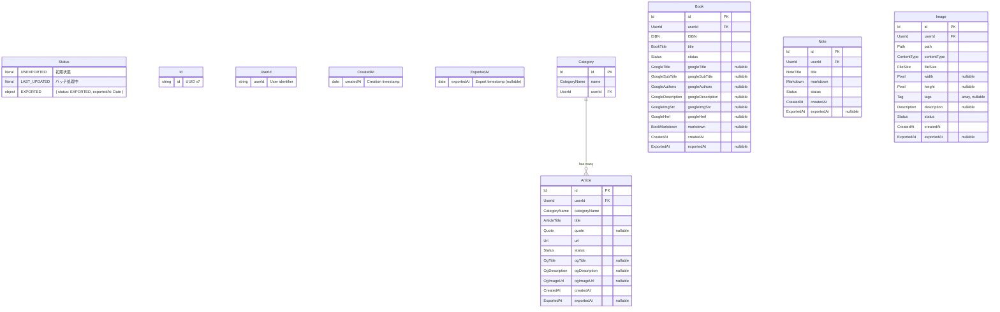
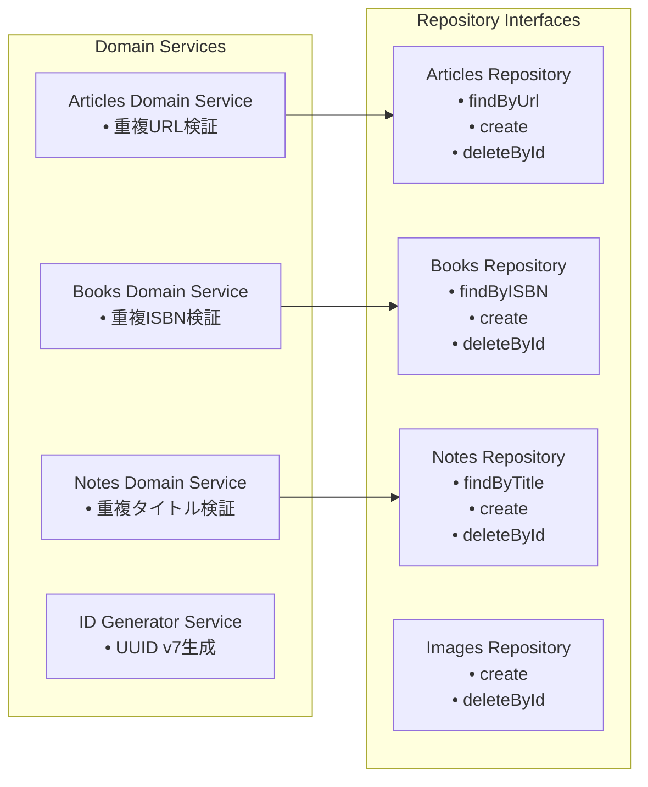
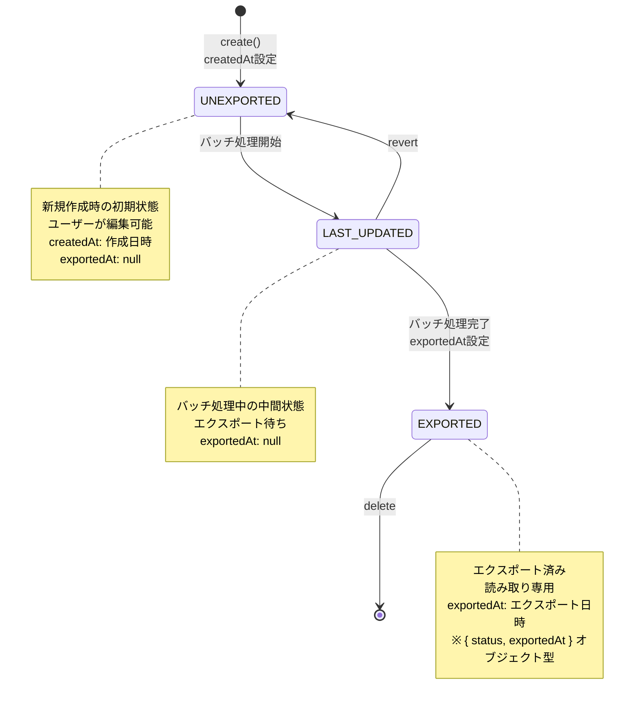
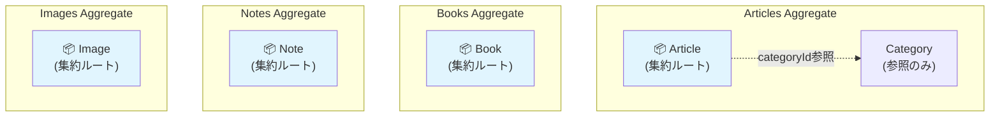
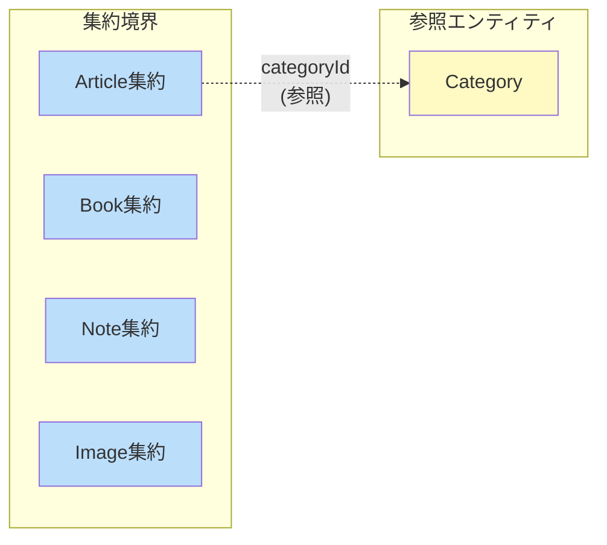
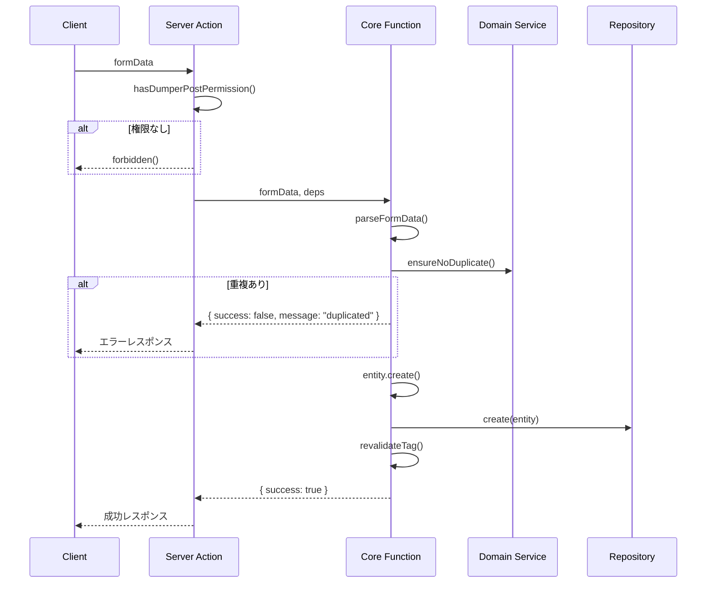

# ドメインモデル図

このドキュメントは、`packages/core/` 配下で定義されているドメインモデルの構造と関係性を可視化しています。

## ドメイン概要

本システムは Clean Architecture に基づいて設計されており、以下の4つの主要ドメインを持っています：

- **Articles**: 記事管理（カテゴリー付き、OGメタデータ対応）
- **Books**: 書籍管理（ISBN、Google Books API連携）
- **Notes**: ノート管理（Markdown形式）
- **Images**: 画像管理（MinIO連携、サムネイル生成）

これらのドメインは共通の **Common** ドメインで定義された基本的な Value Objects を使用しています。

## エンティティ関係図



## ドメイン境界とアーキテクチャ


## ドメインサービスの責務



## 共通ライフサイクル

全てのエンティティは共通のステータスライフサイクルを持ちます：



## 集約（Aggregate）境界

DDDにおける集約は、データ変更のための整合性境界を定義します。各集約は一貫性を保証し、集約ルートを通じてのみアクセスされます。

### 集約ルートの定義



### 各集約の詳細

| 集約 | 集約ルート | 含まれる要素 | 不変条件 |
|------|-----------|-------------|----------|
| **Articles** | `Article` | Article（単独）| URLはユーザーごとに一意 |
| **Books** | `Book` | Book（単独）| ISBNはユーザーごとに一意 |
| **Notes** | `Note` | Note（単独）| タイトルはユーザーごとに一意 |
| **Images** | `Image` | Image（単独）| パスはユーザーごとに一意 |

### 集約間の関係



### 設計上の考慮事項

#### 1. Category の位置付け
- **現状**: Articleはドメイン層で`categoryName`（値オブジェクト）を保持し、インフラ層で`categoryId`（FK）として永続化
- **設計判断**: Categoryは独立した集約ではなく、Article作成時に`connectOrCreate`パターンで管理
- **理由**: Categoryの更新頻度が低く、単独で整合性を保証する必要がないため

#### 2. トランザクション境界
- 各集約は独立してトランザクション整合性を保証
- 集約をまたぐ操作はドメインイベントによる結果整合性（eventual consistency）で対応

#### 3. リポジトリの責任範囲
- 各集約ルートに対して1つのCommand/Queryリポジトリペアを定義
- リポジトリは集約全体の永続化を担当

```
// リポジトリと集約の対応
ArticlesCommandRepository → Article集約
ArticlesQueryRepository   → Article集約の読み取り

BooksCommandRepository    → Book集約
BooksQueryRepository      → Book集約の読み取り

NotesCommandRepository    → Note集約
NotesQueryRepository      → Note集約の読み取り

ImagesCommandRepository   → Image集約
ImagesQueryRepository     → Image集約の読み取り
```

### 集約の不変条件（Invariants）

各集約が保証すべきビジネスルール：

#### Article集約
1. URLは同一ユーザー内で重複不可（`ArticlesDomainService.ensureNoDuplicate`で検証）
2. ステータス遷移は UNEXPORTED → LAST_UPDATED → EXPORTED
3. 必須フィールド: userId, categoryName, title, url

#### Book集約
1. ISBNは同一ユーザー内で重複不可（`BooksDomainService.ensureNoDuplicate`で検証）
2. ステータス遷移は UNEXPORTED → LAST_UPDATED → EXPORTED
3. 必須フィールド: userId, ISBN, title

#### Note集約
1. タイトルは同一ユーザー内で重複不可（`NotesDomainService.ensureNoDuplicate`で検証）
2. ステータス遷移は UNEXPORTED → LAST_UPDATED → EXPORTED
3. 必須フィールド: userId, title, markdown

#### Image集約
1. パスは同一ユーザー内で重複不可（生成時にUUID prefix付与 + `ImagesDomainService.ensureNoDuplicate`で検証）
2. ステータス遷移は UNEXPORTED → LAST_UPDATED → EXPORTED
3. 必須フィールド: userId, path, contentType, fileSize

---

## Application Service層

Application Service層は、ドメインロジックとインフラストラクチャ層をつなぐ役割を担います。Server Actionとしてクライアントに公開され、認証・認可とビジネスロジックを分離した設計になっています。

### ファイル構成パターン

各機能（add, delete等）は以下の4ファイル構成で実装されます：

```
app/src/application-services/{domain}/
├── {action}.deps.ts    ← 依存の型定義とデフォルト値
├── {action}.core.ts    ← Core関数（ビジネスロジック、"use server"なし）
├── {action}.ts         ← Server Action wrapper（認証・認可のみ）
└── {action}.test.ts    ← テスト（Core関数を直接テスト）
```

| ファイル | 責務 | "use server" |
|---------|------|-------------|
| `*.deps.ts` | 依存の型定義（Repository, Domain Service Factory）とデフォルト値 | なし |
| `*.core.ts` | ビジネスロジック（フォームパース、ドメイン検証、永続化、キャッシュ無効化） | なし |
| `*.ts` | Server Action（認証・認可チェック後にCoreを呼び出し） | あり |
| `*.test.ts` | Core関数のユニットテスト（モック依存注入） | なし |

### 設計原則

#### 1. 認証・認可とビジネスロジックの分離

Server Actionは認証・認可チェックのみを行い、ビジネスロジックはCore関数に委譲します：

```typescript
// add-article.ts (Server Action)
"use server";
export async function addArticle(formData: FormData): Promise<ServerAction> {
  const hasPermission = await hasDumperPostPermission();
  if (!hasPermission) forbidden();

  return addArticleCore(formData, defaultAddArticleDeps);
}
```

```typescript
// add-article.core.ts (Core関数)
import "server-only";
export async function addArticleCore(
  formData: FormData,
  deps: AddArticleDeps,
): Promise<ServerAction> {
  // ビジネスロジック（フォームパース、重複チェック、エンティティ作成、永続化）
}
```

#### 2. セキュリティ

- **Core関数は`"use server"`の外に配置**: クライアントから直接呼び出し不可
- **`import "server-only"`でクライアント側インポート防止**: Core関数ファイルに必須
- **クライアントからはServer Actionのみ呼び出し可能**: 認証・認可を必ず通過

#### 3. テスタビリティ

Core関数は依存性注入（DI）で設計されており、テスト時にモック依存を注入可能：

```typescript
// add-article.deps.ts
export type AddArticleDeps = {
  commandRepository: IArticlesCommandRepository;
  domainServiceFactory: ReturnType<typeof createDomainServiceFactory>;
};

export const defaultAddArticleDeps: AddArticleDeps = {
  commandRepository: articlesCommandRepository,
  domainServiceFactory: domainServiceFactory,
};
```

```typescript
// add-article.test.ts
function createMockDeps(): { deps: AddArticleDeps; ... } {
  const mockCommandRepository: IArticlesCommandRepository = {
    create: vi.fn(),
    deleteById: vi.fn(),
  };
  // ...
  return { deps, mockCommandRepository, mockEnsureNoDuplicate };
}

test("should create article successfully", async () => {
  const { deps, mockCommandRepository } = createMockDeps();
  const result = await addArticleCore(mockFormData, deps);
  expect(mockCommandRepository.create).toHaveBeenCalled();
});
```

### アーキテクチャ図

```mermaid
graph TB
    subgraph "Client"
        Client[React Component]
    end

    subgraph "Server Action Layer"
        SA["Server Action<br/>add-article.ts<br/>(認証・認可)"]
    end

    subgraph "Core Layer"
        Core["Core Function<br/>add-article.core.ts<br/>(ビジネスロジック)"]
    end

    subgraph "Dependencies Layer"
        Deps["Dependencies<br/>add-article.deps.ts"]
        Deps --> Repo[Command Repository]
        Deps --> DSF[Domain Service Factory]
    end

    subgraph "Domain Layer"
        DS[Domain Service<br/>重複チェック]
        Entity[Entity Factory<br/>エンティティ生成]
    end

    Client -->|"呼び出し可能"| SA
    Client -.->|"呼び出し不可<br/>(server-only)"| Core
    SA -->|"権限チェック後"| Core
    Core -->|"依存注入"| Deps
    Core --> DS
    Core --> Entity

    style SA fill:#e3f2fd
    style Core fill:#fff3e0
    style Client fill:#e8f5e9
```

### データフロー



---

## 特徴

### Value Objects の活用
- 全ての値は適切に型付けされた Value Objects として定義
- Zod を使用した実行時バリデーション
- Brand Types による型安全性の確保

### Repository パターン
- 各ドメインに Command と Query の Repository インターフェースを分離
- 依存性逆転の原則に従った設計

### ドメインサービス
- 複雑なビジネスロジック（重複チェック等）をドメインサービスに配置
- 各ドメインの固有ルールを適切にカプセル化

### エンティティファクトリー
- エンティティの生成ロジックをファクトリーメソッドとして実装
- 不正な状態のオブジェクト生成を防止

## DDDからの意図的な逸脱

このドキュメントでは、DDDの原則から意図的に外れる設計判断とその理由を記載します。

### 001: 状態遷移ルールがバッチサービスに存在する

#### 概要

状態遷移ロジック（`UNEXPORTED → LAST_UPDATED → EXPORTED`）がエンティティ外のバッチサービスに存在しています。

#### DDDの原則との乖離

- 状態遷移ルールがエンティティ外に存在
- 不正な状態遷移を型レベルで防げない
- DDDの原則（エンティティがビジネスルールを持つ）に反する

#### 対応しない理由

**パフォーマンス優先**: バッチ処理で `updateMany` による一括ステータス更新を行いたいため。

エンティティに状態遷移メソッドを追加すると、各レコードを個別に取得・更新する必要があり、大量データのバッチ処理で著しいパフォーマンス低下を招きます。

#### 対象ファイル

- `packages/core/articles/services/articles-batch-domain-service.ts`
- `packages/core/notes/services/notes-batch-domain-service.ts`
- `packages/core/books/services/books-batch-domain-service.ts`
- `packages/core/images/services/images-batch-domain-service.ts`

#### リスク軽減策

- バッチサービス内に状態遷移ロジックをコメントで明記
- 状態遷移を行うメソッドをバッチサービスに集約し、分散を防ぐ
