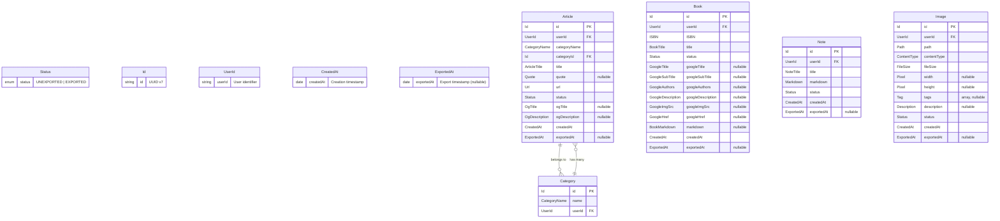
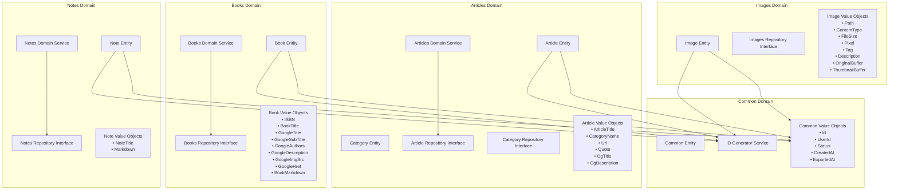
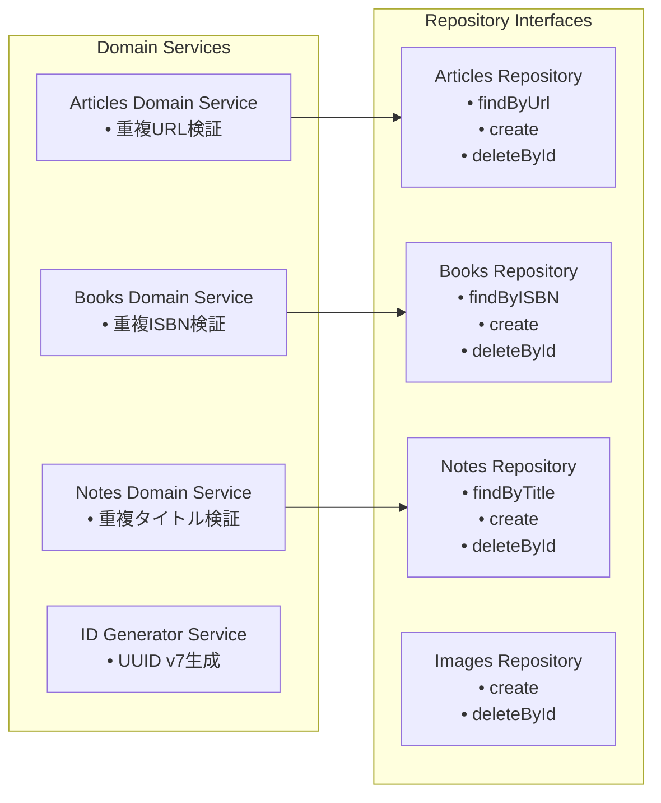
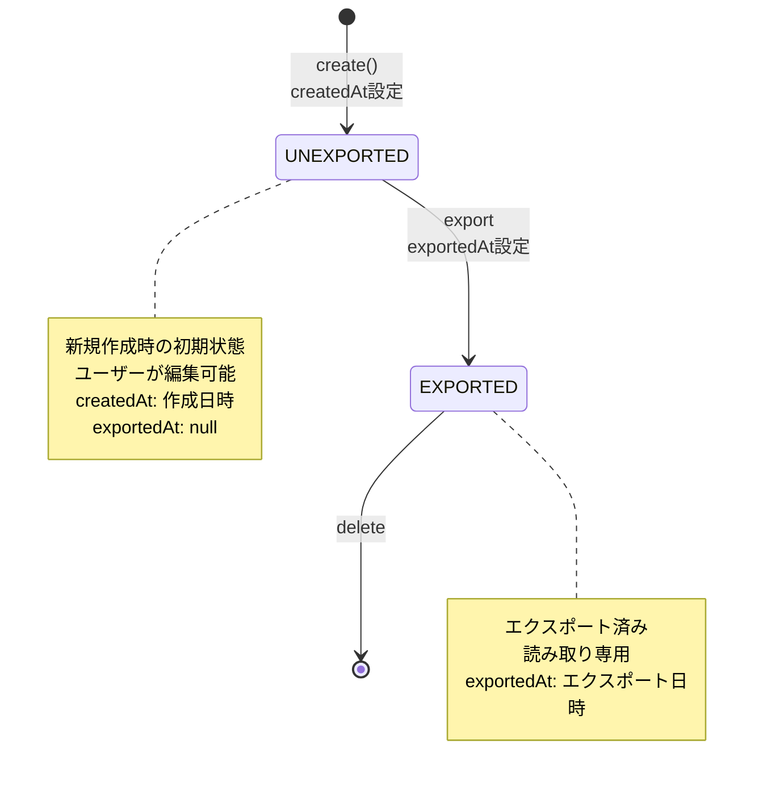

# ドメインモデル図

このドキュメントは、`src/domains/` 配下で定義されているドメインモデルの構造と関係性を可視化しています。

## ドメイン概要

本システムは Clean Architecture に基づいて設計されており、以下の4つの主要ドメインを持っています：

- **Articles**: 記事管理（カテゴリー付き、OGメタデータ対応）
- **Books**: 書籍管理（ISBN、Google Books API連携）
- **Notes**: ノート管理（Markdown形式）
- **Images**: 画像管理（MinIO連携、サムネイル生成）

これらのドメインは共通の **Common** ドメインで定義された基本的な Value Objects を使用しています。

## エンティティ関係図

## ドメイン境界とアーキテクチャ

## ドメインサービスの責務

## 共通ライフサイクル

全てのエンティティは共通のステータスライフサイクルを持ちます：

## 特徴

### Value Objects の活用
- 全ての値は適切に型付けされた Value Objects として定義
- Zod を使用した実行時バリデーション
- Brand Types による型安全性の確保

### Repository パターン
- 各ドメインに Command と Query の Repository インターフェースを分離
- 依存性逆転の原則に従った設計

### ドメインサービス
- 複雑なビジネスロジック（重複チェック等）をドメインサービスに配置
- 各ドメインの固有ルールを適切にカプセル化

### エンティティファクトリー
- エンティティの生成ロジックをファクトリーメソッドとして実装
- 不正な状態のオブジェクト生成を防止