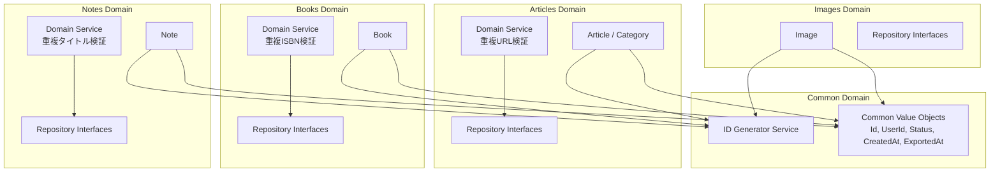
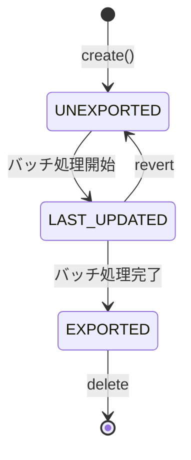
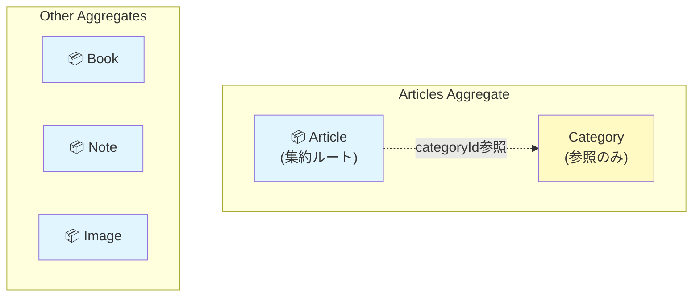
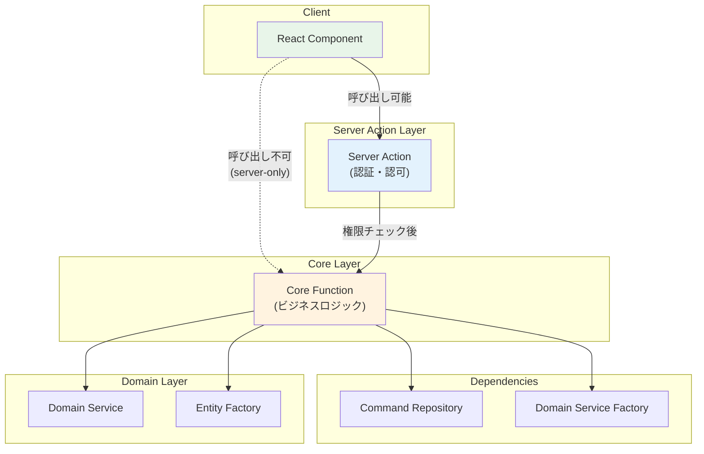

# ドメインモデル図

このドキュメントは、`packages/core/` 配下で定義されているドメインモデルの構造と関係性を可視化しています。

## ドメイン概要

本システムは Clean Architecture に基づいて設計されており、以下の4つの主要ドメインを持っています：

- **Articles**: 記事管理（カテゴリー付き、OGメタデータ対応）
- **Books**: 書籍管理（ISBN、Google Books API連携）
- **Notes**: ノート管理（Markdown形式）
- **Images**: 画像管理（MinIO連携、サムネイル生成）

これらのドメインは共通の **Common** ドメインで定義された基本的な Value Objects を使用しています。

## エンティティ関係図


## ドメイン境界とアーキテクチャ



### ドメインサービスの責務

| ドメインサービス | 主な責務 | 使用するリポジトリメソッド |
|-----------------|---------|------------------------|
| ArticlesDomainService | 重複URL検証 | findByUrl |
| BooksDomainService | 重複ISBN検証 | findByISBN |
| NotesDomainService | 重複タイトル検証 | findByTitle |
| IdGeneratorService | UUID v7生成 | - |

## 共通ライフサイクル

全てのエンティティは共通のステータスライフサイクルを持ちます：



- **UNEXPORTED**: 新規作成時の初期状態。ユーザーが編集可能。`exportedAt: null`
- **LAST_UPDATED**: バッチ処理中の中間状態。エクスポート待ち
- **EXPORTED**: エクスポート済み。読み取り専用。`exportedAt`にエクスポート日時が設定される

## 集約（Aggregate）境界

DDDにおける集約は、データ変更のための整合性境界を定義します。



### 集約の詳細と不変条件

| 集約 | 集約ルート | 不変条件 | 検証サービス |
|------|-----------|----------|-------------|
| **Articles** | Article | URLはユーザーごとに一意 | `ArticlesDomainService.ensureNoDuplicate` |
| **Books** | Book | ISBNはユーザーごとに一意 | `BooksDomainService.ensureNoDuplicate` |
| **Notes** | Note | タイトルはユーザーごとに一意 | `NotesDomainService.ensureNoDuplicate` |
| **Images** | Image | パスはユーザーごとに一意 | `ImagesDomainService.ensureNoDuplicate` |

全集約共通: ステータス遷移は UNEXPORTED → LAST_UPDATED → EXPORTED

> **コードリファレンス**: 各集約ルートはコード内のJSDocでも明示的に文書化されています。
> - `packages/core/articles/entities/article-entity.ts` - `articleEntity`
> - `packages/core/books/entities/books-entity.ts` - `bookEntity`
> - `packages/core/notes/entities/note-entity.ts` - `noteEntity`
> - `packages/core/images/entities/image-entity.ts` - `imageEntity`

### 設計上の考慮事項

- **Categoryの位置付け**: Articleはドメイン層で`categoryName`（値オブジェクト）を保持し、インフラ層で`categoryId`（FK）として永続化。`connectOrCreate`パターンで管理
- **トランザクション境界**: 各集約は独立してトランザクション整合性を保証
- **リポジトリの責任**: 各集約ルートに対して1つのCommand/Queryリポジトリペアを定義

## Application Service層

Application Service層は、ドメインロジックとインフラストラクチャ層をつなぐ役割を担います。認証・認可とビジネスロジックを分離した設計になっています。

### ファイル構成パターン

```
app/src/application-services/{domain}/
├── {action}.deps.ts    ← 依存の型定義とデフォルト値
├── {action}.core.ts    ← Core関数（ビジネスロジック、"use server"なし）
├── {action}.ts         ← Server Action wrapper（認証・認可のみ）
└── {action}.test.ts    ← テスト（Core関数を直接テスト）
```

| ファイル | 責務 | "use server" |
|---------|------|-------------|
| `*.deps.ts` | 依存の型定義（Repository, Domain Service Factory）とデフォルト値 | なし |
| `*.core.ts` | ビジネスロジック（フォームパース、ドメイン検証、永続化、キャッシュ無効化） | なし |
| `*.ts` | Server Action（認証・認可チェック後にCoreを呼び出し） | あり |
| `*.test.ts` | Core関数のユニットテスト（モック依存注入） | なし |

### 設計原則

```typescript
// add-article.ts (Server Action) - 認証・認可のみ
"use server";
export async function addArticle(formData: FormData): Promise<ServerAction> {
  const hasPermission = await hasDumperPostPermission();
  if (!hasPermission) forbidden();
  return addArticleCore(formData, defaultAddArticleDeps);
}

// add-article.core.ts (Core関数) - ビジネスロジック
import "server-only";
export async function addArticleCore(formData: FormData, deps: AddArticleDeps): Promise<ServerAction> {
  // フォームパース、重複チェック、エンティティ作成、永続化
}
```

**セキュリティ**: Core関数は`"use server"`の外に配置し、`import "server-only"`でクライアント側インポートを防止。クライアントからはServer Actionのみ呼び出し可能。

**テスタビリティ**: Core関数は依存性注入（DI）で設計。テスト時にモック依存を注入可能。

### アーキテクチャ図



## 設計の特徴

- **Value Objects**: 全ての値は適切に型付けされた Value Objects として定義。Zodによる実行時バリデーションとBrand Typesによる型安全性
- **Repositoryパターン**: 各ドメインにCommand/Queryリポジトリを分離。依存性逆転の原則に従った設計
- **ドメインサービス**: 複雑なビジネスロジック（重複チェック等）を配置し、各ドメインの固有ルールをカプセル化
- **エンティティファクトリー**: エンティティの生成ロジックをファクトリーメソッドとして実装し、不正な状態のオブジェクト生成を防止

## DDDからの意図的な逸脱

このドキュメントでは、DDDの原則から意図的に外れる設計判断とその理由を記載します。

### 001: 状態遷移ルールがバッチサービスに存在する

#### 概要

状態遷移ロジック（`UNEXPORTED → LAST_UPDATED → EXPORTED`）がエンティティ外のバッチサービスに存在しています。

#### DDDの原則との乖離

- 状態遷移ルールがエンティティ外に存在
- 不正な状態遷移を型レベルで防げない
- DDDの原則（エンティティがビジネスルールを持つ）に反する

#### 対応しない理由

**パフォーマンス優先**: バッチ処理で `updateMany` による一括ステータス更新を行いたいため。

エンティティに状態遷移メソッドを追加すると、各レコードを個別に取得・更新する必要があり、大量データのバッチ処理で著しいパフォーマンス低下を招きます。

#### 対象ファイル

- `packages/core/articles/services/articles-batch-domain-service.ts`
- `packages/core/notes/services/notes-batch-domain-service.ts`
- `packages/core/books/services/books-batch-domain-service.ts`
- `packages/core/images/services/images-batch-domain-service.ts`

#### リスク軽減策

- バッチサービス内に状態遷移ロジックをコメントで明記
- 状態遷移を行うメソッドをバッチサービスに集約し、分散を防ぐ
