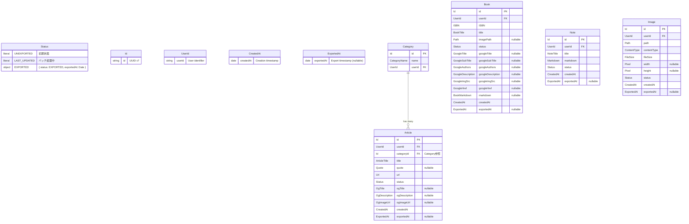

# ドメインモデル図

このドキュメントは、`packages/core/` 配下で定義されているドメインモデルの構造と関係性を可視化しています。

## ドメイン概要

本システムは Clean Architecture に基づいて設計されており、以下の4つの主要ドメインを持っています：

- **Articles**: 記事管理（カテゴリー付き、OGメタデータ対応）
- **Books**: 書籍管理（ISBN、GitHub Books連携）
- **Notes**: ノート管理（Markdown形式）
- **Images**: 画像管理（MinIO連携、サムネイル生成）

これらのドメインは共通の **Common** ドメインで定義された基本的な Value Objects を使用しています。

## エンティティ関係図



## ドメイン境界とアーキテクチャ


### ドメインサービスの責務

| ドメインサービス | 主な責務 | 使用するリポジトリメソッド |
|-----------------|---------|------------------------|
| ArticlesDomainService | 重複URL検証 | findByUrl |
| CategoryService | カテゴリ解決（既存検索または新規作成） | findByNameAndUser, create |
| BooksDomainService | 重複ISBN検証 | findByISBN |
| NotesDomainService | 重複タイトル検証 | findByTitle |
| IdGeneratorService | UUID v7生成 | - |

## 共通ライフサイクル

全てのエンティティは共通のステータスライフサイクルを持ちます：


- **UNEXPORTED**: 新規作成時の初期状態。ユーザーが編集可能。`exportedAt: null`
- **LAST_UPDATED**: バッチ処理中の中間状態。エクスポート待ち
- **EXPORTED**: エクスポート済み。読み取り専用。`exportedAt`にエクスポート日時が設定される

## 集約（Aggregate）境界

DDDにおける集約は、データ変更のための整合性境界を定義します。


### 集約の詳細と不変条件

| 集約 | 集約ルート | 不変条件 | 検証サービス |
|------|-----------|----------|-------------|
| **Articles** | Article | URLはユーザーごとに一意 | `ArticlesDomainService.ensureNoDuplicate` |
| **Books** | Book | ISBNはユーザーごとに一意 | `BooksDomainService.ensureNoDuplicate` |
| **Notes** | Note | タイトルはユーザーごとに一意 | `NotesDomainService.ensureNoDuplicate` |
| **Images** | Image | パスはユーザーごとに一意 | `ImagesDomainService.ensureNoDuplicate` |

全集約共通: ステータス遷移は UNEXPORTED → LAST_UPDATED → EXPORTED

> **コードリファレンス**: 各集約ルート（単一エンティティで構成）は `packages/core/{domain}/entities/{domain}-entity.ts` に定義

### 設計上の考慮事項

- **Categoryの位置付け**: CategoryはArticle集約の内部エンティティ。独立したライフサイクルを持たず、Article作成時にのみ`CategoryService.resolveOrCreate()`で解決/作成される
- **トランザクション境界**: 各集約は独立してトランザクション整合性を保証
- **リポジトリの責任**: 各集約ルートに対して1つのCommand/Queryリポジトリペアを定義

## Application Service層

Application Service層は、ドメインロジックとインフラストラクチャ層をつなぐ役割を担います。

### ファイル構成パターン

```
app/src/application-services/{domain}/
├── {action}.deps.ts    ← 依存の型定義とデフォルト値
├── {action}.core.ts    ← Core関数（ビジネスロジック、"use server"なし）
├── {action}.ts         ← Server Action wrapper（認証・認可のみ）
└── {action}.test.ts    ← テスト（Core関数を直接テスト）
```

| ファイル | 責務 | "use server" |
|---------|------|-------------|
| `*.deps.ts` | 依存の型定義（Repository, Domain Service Factory）とデフォルト値 | なし |
| `*.core.ts` | ビジネスロジック（フォームパース、ドメイン検証、永続化、キャッシュ無効化） | なし |
| `*.ts` | Server Action（認証・認可チェック後にCoreを呼び出し） | あり |
| `*.test.ts` | Core関数のユニットテスト（モック依存注入） | なし |

### 設計原則

- **セキュリティ**: Core関数は`"use server"`の外に配置し、`import "server-only"`でクライアント側インポートを防止
- **テスタビリティ**: Core関数は依存性注入（DI）で設計。テスト時にモック依存を注入可能

### アーキテクチャ図


## 設計の特徴

- **Value Objects**: 全ての値はZodによる実行時バリデーションとBrand Typesによる型安全性を持つ
- **Repositoryパターン**: 各ドメインにCommand/Queryリポジトリを分離。依存性逆転の原則に従った設計
- **ドメインサービス**: 複雑なビジネスロジック（重複チェック等）をカプセル化
- **エンティティファクトリー**: 不正な状態のオブジェクト生成を防止

## Context Map

### Bounded Contexts 一覧

| Bounded Context | 主な責務 |
|----------------|---------|
| Articles | URL収集、OGメタデータ取得、カテゴリ分類 |
| Books | ISBN管理、GitHub Books連携 |
| Notes | Markdownノート作成・編集 |
| Images | 画像アップロード、MinIOストレージ連携、サムネイル生成 |
| Shared-Kernel | 共通Value Objects (Id, UserId, Status, Timestamp等) |

### ドメイン間関係図

```
┌─────────────────────────────────────────────────────┐
│                   Shared-Kernel                      │
│  (Id, UserId, Status, CreatedAt, ExportedAt, etc.)  │
└─────────────────────────────────────────────────────┘
         ▲           ▲           ▲           ▲
         │           │           │           │
    ┌────┴────┐ ┌────┴────┐ ┌────┴────┐ ┌────┴────┐
    │Articles │ │  Books  │ │  Notes  │ │ Images  │
    └─────────┘ └─────────┘ └─────────┘ └─────────┘
    (独立)      (独立)      (独立)      (独立)
```

### 独立性の原則

- **相互非依存**: Articles, Books, Notes, Images は相互に依存しない
- **Shared-Kernelのみ参照**: 各ドメインは共有カーネルの共通コンポーネントのみ参照可能
- **Cross-domain import禁止**: 各ドメイン間の直接importは禁止

### 外部システム連携

| External System | Domain | Integration Pattern | Interface |
|----------------|--------|---------------------|-----------|
| GitHub Books | Books | ACL (Anti-Corruption Layer) | `IGitHubBookFetcher` |
| MinIO | Images, Books | Infrastructure Adapter | `IStorageService` |
| Image Processor | Images | Infrastructure Adapter | `IImageProcessor` |
| Auth0 | All | Separate Context | NextAuth.js統合 |

## DDDからの意図的な逸脱

このセクションでは、DDDの原則から意図的に外れる設計判断とその理由を記載します。

### 001: 状態遷移ルールがバッチサービスに存在する

**概要**: 状態遷移ロジック（`UNEXPORTED → LAST_UPDATED → EXPORTED`）がエンティティ外のバッチサービスに存在。

**理由**: バッチ処理で`updateMany`による一括ステータス更新を行うため、パフォーマンス優先で設計。個別エンティティ取得・更新は大量データで著しいパフォーマンス低下を招く。

**対象ファイル**:
- `packages/core/*/services/*-batch-domain-service.ts`

### 002: ドメインイベントサブスクライバーの省略

**概要**: イベント発行機構はあるが、EventBusやイベントハンドラー等の購読側実装は省略。

**理由**: 現在の規模ではオーバースペック。通知システム・検索インデックス・イベントベースのキャッシュ制御等のユースケースが必要になった時点で検討。`*UpdatedEvent`も同様の理由で見送り。

**対象ファイル**:
- `packages/core/*/entities/*-entity.ts`（イベント定義のみ）

### 003: Category エンティティファクトリの省略

**概要**: Categoryには他エンティティのような`*Entity.create()`ファクトリがない。

**理由**: CategoryはArticle集約の内部エンティティで独立したライフサイクルを持たない。`CategoryService.resolveOrCreate()`がカテゴリ解決ロジックをカプセル化しており、独自ファクトリは過度な抽象化。

**対象ファイル**:
- `packages/core/articles/services/category-service.ts`

### 004: 値オブジェクトのエンティティファイル内コロケーション

**概要**: 値オブジェクト（ArticleTitle, Url, Quote等）がエンティティファイル内に同居し、value-objects/ディレクトリに分離していない。

**理由**: Zodスキーマベースで値オブジェクトを定義しており、エンティティと構成要素が同一ファイルにあることで関連性が明確。import文の簡潔化とファイル数削減による可読性向上。

**対象ファイル**:
- `packages/core/*/entities/*-entity.ts`

### 005: DB操作とイベント発行のトランザクション境界

**概要**: DB操作とイベント発行が別々のトランザクションで行われ、不整合リスクがある。

**理由**: 単一ユーザー・単一サーバーの現規模では、Outbox PatternやSaga Pattern導入による複雑性増加がメリットを上回る。TypeScriptでの補償トランザクションの型安全な表現も困難。

**対象ファイル**:
- `app/src/application-services/*/add-*.core.ts`
- `app/src/application-services/*/update-*.core.ts`
- `app/src/application-services/*/delete-*.core.ts`

### 006: 不変条件検証とエンティティ生成の分離

**概要**: 重複チェック等の不変条件検証がエンティティ生成の外で行われ、Application Serviceが呼び出し順序を管理。

**理由**: 型レベルでの検証済み保証は現規模に対して過度な複雑性。既存の全Application Serviceが同一パターンに従っており検証漏れリスクは低い。ファクトリを非同期にするとリポジトリ依存が発生しドメイン層の純粋性が損なわれる。

**対象ファイル**:
- `packages/core/*/services/*-domain-service.ts`

### 007: インフラ層内でのPrisma型直接使用

**概要**: Prisma固有の型（`Prisma.ArticleWhereInput`等）がインフラ層内で直接使用されている。

**理由**: Prisma型の使用はインフラ層内に限定されており、Domain層・Application層への漏洩はない。ORM変更の可能性が現実的に低く、Prisma型による型安全性の恩恵（タイポ検知、補完、リファクタリング支援）が大きい。

**対象ファイル**:
- `app/src/infrastructures/*/prisma-*-query-repository.ts`
- `app/src/infrastructures/*/prisma-*-command-repository.ts`

### 008: 外部サービス連携のACL明示の省略

**概要**: GitHub Books連携に、明示的なACL（Anti-Corruption Layer）パターンとしての専用Translatorクラス等が存在しない。

**理由**: `IGitHubBookFetcher`インターフェースがDomain層で定義済みで、外部データ→ドメインモデル変換はインフラ層実装内で完結。現在の外部サービス連携は1箇所のみで単純（1リクエスト/1レスポンス）なため、形式的なACL層追加は過度な抽象化。

**対象ファイル**:
- `packages/core/books/services/github-book-fetcher.interface.ts`

### 009: キャッシュ無効化のRepository内配置

**概要**: Repositoryにキャッシュ無効化（`revalidateTag`）が含まれ、データ永続化とキャッシュ戦略が混在。

**理由**: `revalidateTag`呼び出しはインフラ層内に限定。Next.jsの`revalidateTag`はインフラ関心事として妥当な配置であり、各Repositoryが同一パターンに従い予測可能な動作を維持。Application Serviceへの移動は責務の二重化を招く。

**対象ファイル**:
- `app/src/infrastructures/*/repositories/*-command-repository.ts`

### 010: Anemic Domain Model（データの入れ物としてのEntity）

**概要**: Entity/Value Objectに振る舞いがなく、ビジネスロジックがApplication Service（Core関数）に集中。

**理由**: TypeScript + Zodによる関数型スタイルを採用しており、Entityを不変データ構造として扱い変換関数をApplication Service層に配置するアプローチは関数型プログラミングの原則に沿う。Core関数は依存性注入により容易にテスト可能。現在のドメインのビジネスロジックは「重複チェック」「状態遷移」程度でシンプル。

**対象ファイル**:
- `packages/core/*/entities/*-entity.ts`

### 011: Entity更新パターンの省略

**概要**: Entity更新がRepository直接操作になっており、Entity側に`with*`, `update*`等の更新メソッドがない。

**理由**: Anemic Domain Model（010）を意図的に採用しているため、更新メソッドもEntity外に配置する方が一貫性がある。現在の更新操作は主にOGメタデータ更新・Google Books情報更新・ステータス更新の3種類のみで単純。ステータス更新はバッチ処理で一括実行される（001参照）。

**対象ファイル**:
- `app/src/infrastructures/*/repositories/*-command-repository.ts`

### 012: DIコンテナ・CQRS等の高度な設計パターンの不採用

**概要**: DIコンテナ（InversifyJS, tsyringe等）やCQRS、イベントソーシング等の高度なDDD設計パターンは導入しない。

**理由**: 単一ユーザー向けの個人コンテンツ管理システムであり、これらのパターンは過度な複雑性をもたらす。手動DI（ファクトリ関数）で十分であり、読み取り/書き込みのスケーリング要件もない。Next.js App RouterのServer Actions + 関数型スタイルでは、関数とファクトリによる依存注入の方が自然。

**対象ファイル**:
- `app/src/application-services/*/*.deps.ts`

### 013: ドメインイベントのバージョニング省略

**概要**: `BaseDomainEvent`にイベントスキーマのバージョンを示すフィールドがない。

**理由**: イベントサブスクライバーが未実装（002参照）のため、現時点でバージョニングによる後方互換性維持の必要性がない。イベントソーシングも導入予定なし。イベントサブスクライバー実装を検討する際に併せて対応。

**対象ファイル**:
- `packages/core/shared-kernel/events/base-domain-event.ts`
- `packages/core/shared-kernel/events/domain-event.interface.ts`

### 014: インフラ関連型のshared-kernel配置

**概要**: `InfraQueryOptions`（ページネーション・キャッシュ設定）がドメイン層の`shared-kernel/types/`に配置されている。

**理由**:
- ページネーション・キャッシュは全クエリで必須であり、リポジトリインターフェースから除外するとDIが破綻する
- `packages/core`は独立パッケージであり、app層のインフラ型を参照できないため、shared-kernelに配置
- 型を完全に分離すると呼び出し側でキャストが必要になり型安全性が低下
- 影響は限定的（`InfraQueryOptions`、`PaginationOptions`のみ）で制御可能

**対象ファイル**:
- `packages/core/shared-kernel/types/query-options.ts`
- `packages/core/*/repositories/*-query-repository.interface.ts`
