# ドメインモデル図

このドキュメントは、`src/domains/` 配下で定義されているドメインモデルの構造と関係性を可視化しています。

## ドメイン概要

本システムは Clean Architecture に基づいて設計されており、以下の4つの主要ドメインを持っています：

- **Articles**: 記事管理（カテゴリー付き、OGメタデータ対応）
- **Books**: 書籍管理（ISBN、Google Books API連携）
- **Notes**: ノート管理（Markdown形式）
- **Images**: 画像管理（MinIO連携、サムネイル生成）

これらのドメインは共通の **Common** ドメインで定義された基本的な Value Objects を使用しています。

## エンティティ関係図


## ドメイン境界とアーキテクチャ


## ドメインサービスの責務

```mermaid
graph LR
    subgraph "Domain Services"
        ArticlesDomainService[Articles Domain Service<br/>• 重複URL検証]
        BooksDomainService[Books Domain Service<br/>• 重複ISBN検証]
        NotesDomainService[Notes Domain Service<br/>• 重複タイトル検証]
        IdGeneratorService[ID Generator Service<br/>• UUID v7生成]
    end

    subgraph "Repository Interfaces"
        ArticlesRepo[Articles Repository<br/>• findByUrl<br/>• create<br/>• deleteById]
        BooksRepo[Books Repository<br/>• findByISBN<br/>• create<br/>• deleteById]
        NotesRepo[Notes Repository<br/>• findByTitle<br/>• create<br/>• deleteById]
        ImagesRepo[Images Repository<br/>• create<br/>• deleteById]
    end

    ArticlesDomainService --> ArticlesRepo
    BooksDomainService --> BooksRepo
    NotesDomainService --> NotesRepo
```



## 共通ライフサイクル

全てのエンティティは共通のステータスライフサイクルを持ちます：

```mermaid
stateDiagram-v2
    [*] --> UNEXPORTED : create()<br/>createdAt設定
    UNEXPORTED --> EXPORTED : export<br/>exportedAt設定
    EXPORTED --> [*] : delete
    
    note right of UNEXPORTED
        新規作成時の初期状態
        ユーザーが編集可能
        createdAt: 作成日時
        exportedAt: null
    end note
    
    note right of EXPORTED
        エクスポート済み
        読み取り専用
        exportedAt: エクスポート日時
    end note
```



## 集約（Aggregate）境界

DDDにおける集約は、データ変更のための整合性境界を定義します。各集約は一貫性を保証し、集約ルートを通じてのみアクセスされます。

### 集約ルートの定義

```mermaid
graph TB
    subgraph "Articles Aggregate"
        ArticleRoot["📦 Article<br/>(集約ルート)"]
        ArticleCategory["Category<br/>(参照のみ)"]
        ArticleRoot -.->|"categoryId参照"| ArticleCategory
    end

    subgraph "Books Aggregate"
        BookRoot["📦 Book<br/>(集約ルート)"]
    end

    subgraph "Notes Aggregate"
        NoteRoot["📦 Note<br/>(集約ルート)"]
    end

    subgraph "Images Aggregate"
        ImageRoot["📦 Image<br/>(集約ルート)"]
    end

    style ArticleRoot fill:#e1f5fe
    style BookRoot fill:#e1f5fe
    style NoteRoot fill:#e1f5fe
    style ImageRoot fill:#e1f5fe
```



### 各集約の詳細

| 集約 | 集約ルート | 含まれる要素 | 不変条件 |
|------|-----------|-------------|----------|
| **Articles** | `Article` | Article（単独）| URLはユーザーごとに一意 |
| **Books** | `Book` | Book（単独）| ISBNはユーザーごとに一意 |
| **Notes** | `Note` | Note（単独）| タイトルはユーザーごとに一意 |
| **Images** | `Image` | Image（単独）| パスはユーザーごとに一意 |

### 集約間の関係

```mermaid
graph LR
    subgraph "集約境界"
        A[Article集約]
        B[Book集約]
        N[Note集約]
        I[Image集約]
    end

    subgraph "参照エンティティ"
        C[Category]
    end

    A -.->|"categoryId<br/>(参照)"| C

    style A fill:#bbdefb
    style B fill:#bbdefb
    style N fill:#bbdefb
    style I fill:#bbdefb
    style C fill:#fff9c4
```



### 設計上の考慮事項

#### 1. Category の位置付け
- **現状**: CategoryはArticle集約内で`categoryName`と`categoryId`として保持
- **設計判断**: Categoryは独立した集約ではなく、Article作成時に`connectOrCreate`パターンで管理
- **理由**: Categoryの更新頻度が低く、単独で整合性を保証する必要がないため

#### 2. トランザクション境界
- 各集約は独立してトランザクション整合性を保証
- 集約をまたぐ操作はドメインイベントによる結果整合性（eventual consistency）で対応

#### 3. リポジトリの責任範囲
- 各集約ルートに対して1つのCommand/Queryリポジトリペアを定義
- リポジトリは集約全体の永続化を担当

```
// リポジトリと集約の対応
ArticlesCommandRepository → Article集約
ArticlesQueryRepository   → Article集約の読み取り

BooksCommandRepository    → Book集約
BooksQueryRepository      → Book集約の読み取り

NotesCommandRepository    → Note集約
NotesQueryRepository      → Note集約の読み取り

ImagesCommandRepository   → Image集約
ImagesQueryRepository     → Image集約の読み取り
```

### 集約の不変条件（Invariants）

各集約が保証すべきビジネスルール：

#### Article集約
1. URLは同一ユーザー内で重複不可（`ArticlesDomainService.ensureNoDuplicate`で検証）
2. ステータス遷移は UNEXPORTED → EXPORTED のみ
3. 必須フィールド: userId, categoryName, title, url

#### Book集約
1. ISBNは同一ユーザー内で重複不可（`BooksDomainService.ensureNoDuplicate`で検証）
2. ステータス遷移は UNEXPORTED → EXPORTED のみ
3. 必須フィールド: userId, ISBN, title

#### Note集約
1. タイトルは同一ユーザー内で重複不可（`NotesDomainService.ensureNoDuplicate`で検証）
2. ステータス遷移は UNEXPORTED → EXPORTED のみ
3. 必須フィールド: userId, title, markdown

#### Image集約
1. パスは同一ユーザー内で重複不可（生成時にUUID prefix付与で保証）
2. ステータス遷移は UNEXPORTED → EXPORTED のみ
3. 必須フィールド: userId, path, contentType, fileSize

---

## 特徴

### Value Objects の活用
- 全ての値は適切に型付けされた Value Objects として定義
- Zod を使用した実行時バリデーション
- Brand Types による型安全性の確保

### Repository パターン
- 各ドメインに Command と Query の Repository インターフェースを分離
- 依存性逆転の原則に従った設計

### ドメインサービス
- 複雑なビジネスロジック（重複チェック等）をドメインサービスに配置
- 各ドメインの固有ルールを適切にカプセル化

### エンティティファクトリー
- エンティティの生成ロジックをファクトリーメソッドとして実装
- 不正な状態のオブジェクト生成を防止