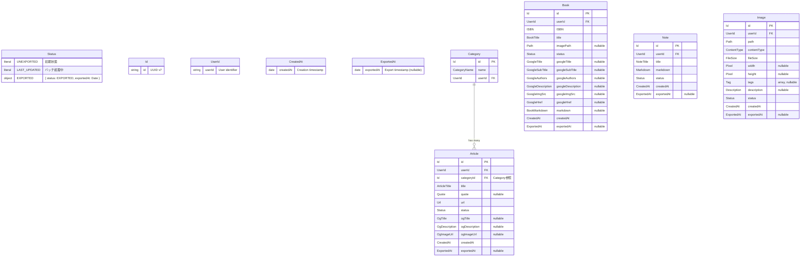

# ドメインモデル図

このドキュメントは、`packages/core/` 配下で定義されているドメインモデルの構造と関係性を可視化しています。

## ドメイン概要

本システムは Clean Architecture に基づいて設計されており、以下の4つの主要ドメインを持っています：

- **Articles**: 記事管理（カテゴリー付き、OGメタデータ対応）
- **Books**: 書籍管理（ISBN、GitHub Books連携）
- **Notes**: ノート管理（Markdown形式）
- **Images**: 画像管理（MinIO連携、サムネイル生成）

これらのドメインは共通の **Common** ドメインで定義された基本的な Value Objects を使用しています。

## エンティティ関係図



## ドメイン境界とアーキテクチャ


### ドメインサービスの責務

| ドメインサービス | 主な責務 | 使用するリポジトリメソッド |
|-----------------|---------|------------------------|
| ArticlesDomainService | 重複URL検証 | findByUrl |
| CategoryService | カテゴリ解決（既存検索または新規作成） | findByNameAndUser, create |
| BooksDomainService | 重複ISBN検証 | findByISBN |
| NotesDomainService | 重複タイトル検証 | findByTitle |
| IdGeneratorService | UUID v7生成 | - |

## 共通ライフサイクル

全てのエンティティは共通のステータスライフサイクルを持ちます：


- **UNEXPORTED**: 新規作成時の初期状態。ユーザーが編集可能。`exportedAt: null`
- **LAST_UPDATED**: バッチ処理中の中間状態。エクスポート待ち
- **EXPORTED**: エクスポート済み。読み取り専用。`exportedAt`にエクスポート日時が設定される

## 集約（Aggregate）境界

DDDにおける集約は、データ変更のための整合性境界を定義します。


### 集約の詳細と不変条件

| 集約 | 集約ルート | 不変条件 | 検証サービス |
|------|-----------|----------|-------------|
| **Articles** | Article | URLはユーザーごとに一意 | `ArticlesDomainService.ensureNoDuplicate` |
| **Books** | Book | ISBNはユーザーごとに一意 | `BooksDomainService.ensureNoDuplicate` |
| **Notes** | Note | タイトルはユーザーごとに一意 | `NotesDomainService.ensureNoDuplicate` |
| **Images** | Image | パスはユーザーごとに一意 | `ImagesDomainService.ensureNoDuplicate` |

全集約共通: ステータス遷移は UNEXPORTED → LAST_UPDATED → EXPORTED

> **コードリファレンス**: 各集約ルートはコード内のJSDocでも明示的に文書化されています。
> - `packages/core/articles/entities/article-entity.ts` - `articleEntity`
> - `packages/core/books/entities/book-entity.ts` - `bookEntity`
> - `packages/core/notes/entities/note-entity.ts` - `noteEntity`
> - `packages/core/images/entities/image-entity.ts` - `imageEntity`

### 設計上の考慮事項

- **Categoryの位置付け**: Category は概念的には Article 集約の一部であり、独立したライフサイクルを持たない。Article 作成時にのみ `CategoryService.resolveOrCreate()` で解決/作成される。ただし、実装上はクエリ最適化とコード整理のため独自リポジトリ（Command/Query）を持つ。これは集約の分離ではなく、サブエンティティの永続化パターンとしての設計選択である
- **トランザクション境界**: 各集約は独立してトランザクション整合性を保証
- **リポジトリの責任**: 各集約ルートに対して1つのCommand/Queryリポジトリペアを定義

## Application Service層

Application Service層は、ドメインロジックとインフラストラクチャ層をつなぐ役割を担います。認証・認可とビジネスロジックを分離した設計になっています。

### ファイル構成パターン

```
app/src/application-services/{domain}/
├── {action}.deps.ts    ← 依存の型定義とデフォルト値
├── {action}.core.ts    ← Core関数（ビジネスロジック、"use server"なし）
├── {action}.ts         ← Server Action wrapper（認証・認可のみ）
└── {action}.test.ts    ← テスト（Core関数を直接テスト）
```

| ファイル | 責務 | "use server" |
|---------|------|-------------|
| `*.deps.ts` | 依存の型定義（Repository, Domain Service Factory）とデフォルト値 | なし |
| `*.core.ts` | ビジネスロジック（フォームパース、ドメイン検証、永続化、キャッシュ無効化） | なし |
| `*.ts` | Server Action（認証・認可チェック後にCoreを呼び出し） | あり |
| `*.test.ts` | Core関数のユニットテスト（モック依存注入） | なし |

### 設計原則

```typescript
// add-article.ts (Server Action) - 認証・認可のみ
"use server";
export async function addArticle(formData: FormData): Promise<ServerAction> {
  const hasPermission = await hasDumperPostPermission();
  if (!hasPermission) forbidden();
  return addArticleCore(formData, defaultAddArticleDeps);
}

// add-article.core.ts (Core関数) - ビジネスロジック
import "server-only";
export async function addArticleCore(formData: FormData, deps: AddArticleDeps): Promise<ServerAction> {
  // フォームパース、重複チェック、エンティティ作成、永続化
}
```

**セキュリティ**: Core関数は`"use server"`の外に配置し、`import "server-only"`でクライアント側インポートを防止。クライアントからはServer Actionのみ呼び出し可能。

**テスタビリティ**: Core関数は依存性注入（DI）で設計。テスト時にモック依存を注入可能。

### アーキテクチャ図


## 設計の特徴

- **Value Objects**: 全ての値は適切に型付けされた Value Objects として定義。Zodによる実行時バリデーションとBrand Typesによる型安全性
- **Repositoryパターン**: 各ドメインにCommand/Queryリポジトリを分離。依存性逆転の原則に従った設計
- **ドメインサービス**: 複雑なビジネスロジック（重複チェック等）を配置し、各ドメインの固有ルールをカプセル化
- **エンティティファクトリー**: エンティティの生成ロジックをファクトリーメソッドとして実装し、不正な状態のオブジェクト生成を防止

## Context Map

### Bounded Contexts 一覧

| Bounded Context | 説明 | 主な責務 |
|----------------|------|---------|
| Articles | 記事管理 | URL収集、OGメタデータ取得、カテゴリ分類 |
| Books | 書籍管理 | ISBN管理、GitHub Books連携 |
| Notes | ノート管理 | Markdownノート作成・編集 |
| Images | 画像管理 | 画像アップロード、MinIOストレージ連携、サムネイル生成 |
| Shared-Kernel | 共有カーネル | 共通Value Objects (Id, UserId, Status, Timestamp等) |

### ドメイン間関係図

```
┌─────────────────────────────────────────────────────┐
│                   Shared-Kernel                      │
│  (Id, UserId, Status, CreatedAt, ExportedAt, etc.)  │
└─────────────────────────────────────────────────────┘
         ▲           ▲           ▲           ▲
         │           │           │           │
    ┌────┴────┐ ┌────┴────┐ ┌────┴────┐ ┌────┴────┐
    │Articles │ │  Books  │ │  Notes  │ │ Images  │
    └─────────┘ └─────────┘ └─────────┘ └─────────┘
    (独立)      (独立)      (独立)      (独立)
```

### 関係パターン

| Source Context | Target Context | Relationship | 説明 |
|---------------|----------------|--------------|------|
| All Domains | Shared-Kernel | Shared Kernel | 共通Value Objects・サービスを共有 |
| Articles | Category | Same Aggregate | CategoryはArticle集約の内部エンティティ |

### 独立性の原則

- **相互非依存**: Articles, Books, Notes, Images は相互に依存しない
- **Shared-Kernelのみ参照**: 各ドメインは共有カーネルの共通コンポーネントのみ参照可能
- **Cross-domain import禁止**: 各ドメイン間の直接importは禁止

### 外部システム連携

| External System | Domain | Integration Pattern | Interface |
|----------------|--------|---------------------|-----------|
| GitHub Books | Books | ACL (Anti-Corruption Layer) | `IGitHubBookFetcher` |
| MinIO | Images, Books | Infrastructure Adapter | `IStorageService` |
| Image Processor | Images | Infrastructure Adapter | `IImageProcessor` |
| Auth0 | All | Separate Context | NextAuth.js統合 |

## DDDからの意図的な逸脱

このドキュメントでは、DDDの原則から意図的に外れる設計判断とその理由を記載します。

### 001: 状態遷移ルールがバッチサービスに存在する

#### 概要

状態遷移ロジック（`UNEXPORTED → LAST_UPDATED → EXPORTED`）がエンティティ外のバッチサービスに存在しています。

#### DDDの原則との乖離

- 状態遷移ルールがエンティティ外に存在
- 不正な状態遷移を型レベルで防げない
- DDDの原則（エンティティがビジネスルールを持つ）に反する

#### 対応しない理由

**パフォーマンス優先**: バッチ処理で `updateMany` による一括ステータス更新を行いたいため。

エンティティに状態遷移メソッドを追加すると、各レコードを個別に取得・更新する必要があり、大量データのバッチ処理で著しいパフォーマンス低下を招きます。

#### 対象ファイル

- `packages/core/articles/services/articles-batch-domain-service.ts`
- `packages/core/notes/services/notes-batch-domain-service.ts`
- `packages/core/books/services/books-batch-domain-service.ts`
- `packages/core/images/services/images-batch-domain-service.ts`

#### リスク軽減策

- バッチサービス内に状態遷移ロジックをコメントで明記
- 状態遷移を行うメソッドをバッチサービスに集約し、分散を防ぐ

### 002: ドメインイベントサブスクライバーの省略

#### 概要

ドメインイベントの発行機構は実装されているが、購読（サブスクライバー）側の本格的な実装（EventBus、イベントハンドラー等）は省略しています。

#### DDDの原則との乖離

- イベント駆動アーキテクチャの活用が限定的
- イベントサブスクライバーの構造化がない
- イベントの永続化がない

#### 対応しない理由

**現状の規模ではオーバースペック**: 現在のシステム規模では、本格的なイベントバスやサブスクライバー機構は過度な抽象化となります。

将来的にシステムが拡大し、以下のようなユースケースが必要になった時点で検討:
- 通知システム（コンテンツ作成時にPushover通知）
- 検索インデックス（コンテンツ更新時にインデックス再構築）
- キャッシュ無効化（イベントベースのキャッシュ制御）

#### リスク軽減策

- 現在のイベント発行機構（`[Entity, Event]` タプル返却、`eventDispatcher.dispatch`）は維持
- 必要性が明確になった時点で段階的に実装を追加

#### 再検討条件

以下の条件が発生した場合、EventBusパターンの導入を検討する：

- 通知失敗時のリトライが必要となった場合
- イベント監査ログが必要となった場合（コンプライアンス要件）
- マイクロサービス分離が必要となった場合
- 非同期イベント処理が必要となった場合（大量イベント）
- イベントソーシングの導入を検討する場合

### 003: Category エンティティファクトリの省略

#### 概要

Category エンティティには他のエンティティ（Article, Book, Note, Image）のような `*Entity.create()` ファクトリを設けていません。

#### DDDの原則との乖離

- エンティティの生成ロジックがドメインサービス（CategoryService）内に直接実装されている
- 他のエンティティとファクトリパターンが異なる

#### 対応しない理由

**CategoryはArticle集約の内部エンティティ**: CategoryはArticle集約の一部であり、独立したライフサイクルを持ちません。

- Categoryの作成はArticle作成のコンテキスト内でのみ発生する
- Category単体のCRUD操作は存在しない
- `CategoryService.resolveOrCreate()` がカテゴリ解決ロジックをカプセル化している

独自のファクトリを設けることは過度な抽象化となり、実際の使用パターンと一致しません。

#### 対象ファイル

- `packages/core/articles/services/category-service.ts`

#### リスク軽減策

- CategoryService内にCategory生成ロジックを集約し、分散を防ぐ
- domain-model.md の集約境界図でCategoryの位置付けを明示

### 004: 値オブジェクトのエンティティファイル内コロケーション

#### 概要

1ファイル内にエンティティと複数の値オブジェクトが定義されている。
DDDでは value-objects/ ディレクトリに分離することが一般的。

#### DDDの原則との乖離

- 値オブジェクト（ArticleTitle, Url, Quote 等）がエンティティファイル内に同居
- ディレクトリ構造上の分離がない

#### 対応しない理由

**Zodスキーマベースの利点**: 現在のアプローチは Zod スキーマで値オブジェクトを定義しており、以下のメリットがある:

- エンティティとその構成要素（値オブジェクト）が同一ファイルにあることで、関連性が明確
- 値オブジェクトの変更がエンティティに与える影響を即座に把握可能
- import 文の簡潔化
- ファイル数の削減による可読性向上

#### 対象ファイル

- `packages/core/articles/entities/article-entity.ts`
- `packages/core/books/entities/book-entity.ts`
- `packages/core/notes/entities/note-entity.ts`
- `packages/core/images/entities/image-entity.ts`

#### 再検討条件

以下の条件が発生した場合、分離を検討する：

- 値オブジェクトを複数ドメイン間で共有する必要が生じた場合
- 1ファイルの行数が著しく増加し可読性が低下した場合
- 値オブジェクトに複雑なビジネスロジックが追加された場合

### 005: DB操作とイベント発行のトランザクション境界

#### 概要

DB操作とイベント発行が別々のトランザクションで行われており、厳密なDDDでは不整合リスクがある設計になっています。

```typescript
// 現在の実装: 複数操作が別々のトランザクション
await commandRepository.create(article);    // DB書き込み
await eventDispatcher.dispatch(event);       // イベント発行
revalidateTag(...);                          // キャッシュ無効化
```

#### DDDの原則との乖離

- DB書き込み成功後、イベント発行失敗の可能性
- 不整合状態のリスク（DBには記録あり、イベント未発行）
- キャッシュ無効化失敗時の古いデータ表示
- イベント発行とDB操作が同一トランザクションで保証されていない

厳密なDDDでは、Outbox Pattern、明示的トランザクション、Saga Pattern などで整合性を担保します。

#### 対応しない理由

**現状の規模ではオーバースペック**: 単一ユーザー・単一サーバーの現規模では、これらのパターン導入による複雑性増加がメリットを上回ります。

**TypeScriptでの表現が困難**: Outbox Pattern はポーリングや CDC（Change Data Capture）等の追加インフラが必要であり、Saga Pattern の補償トランザクションは TypeScript の型システムで安全に表現することが非常に難しいです。

考慮した改善パターン:

| パターン | 概要 | 見送り理由 |
|---------|------|-----------|
| Outbox Pattern | イベントをDBに保存し別プロセスで発行 | 追加インフラ（ポーリング/CDC）が必要 |
| 明示的トランザクション | `prisma.$transaction()` で一括処理 | イベント発行を含めるとDB外部依存が発生 |
| Saga Pattern | 失敗時に補償トランザクションを実行 | 補償ロジックの型安全な表現が困難 |

#### 対象ファイル

- `app/src/application-services/*/add-*.core.ts`
- `app/src/application-services/*/update-*.core.ts`
- `app/src/application-services/*/delete-*.core.ts`
- `app/src/infrastructures/*/prisma-*-command-repository.ts`

#### リスク軽減策

- 現状の規模では失敗確率が極めて低い
- 仮に不整合が発生しても、手動での復旧が容易な規模
- イベント発行失敗時のエラーログで検知可能

#### 再検討条件

以下の条件が発生した場合、トランザクション境界の見直しを検討する：

- 複数サービス間でのイベント連携が必要になった場合
- 高頻度の書き込み操作でイベント発行失敗が観測された場合
- コンプライアンス要件でイベント監査ログの完全性が必要になった場合
- マイクロサービス分離を検討する場合

### 006: 不変条件検証とエンティティ生成の分離

#### 概要

不変条件の検証（重複チェック）がエンティティ生成の外で行われており、Application Service が検証とエンティティ生成の順序を正しく呼び出す責任を負っています。

```typescript
// Application Service での使用パターン
await domainService.ensureNoDuplicate(url, userId);  // 1. 検証
const [article, event] = articleEntity.create({ ... }); // 2. 生成
await commandRepository.create(article);              // 3. 永続化
```

#### DDDの原則との乖離

- 不変条件の検証がエンティティ生成の外で行われている
- Application Service が検証とエンティティ生成の順序を正しく呼び出す責任を負っている
- 検証を忘れた場合、不正なエンティティが生成されるリスク

#### 対応しない理由

**現状の規模ではオーバースペック**: 型レベルでの検証済み保証（Branded Types等）やファクトリへの検証ロジック統合は、現在のコードベース規模に対して過度な複雑性をもたらします。

- Application Service のパターンが確立されており、新規作成時のテンプレートとして機能
- 検証漏れのリスクは低い（既存の全Application Serviceが同一パターンに従っている）
- ファクトリを非同期にするとリポジトリ依存が発生し、ドメイン層の純粋性が損なわれる

#### 対象ファイル

- `packages/core/articles/services/articles-domain-service.ts`
- `packages/core/books/services/books-domain-service.ts`
- `packages/core/notes/services/notes-domain-service.ts`
- `packages/core/images/services/images-domain-service.ts`

#### リスク軽減策

- Application Service のテンプレートパターンを維持
- 新規Application Service作成時は既存コードを参照

### 007: インフラ層内でのPrisma型直接使用

#### 概要

Prisma固有の型（`Prisma.ArticleWhereInput`等）がインフラ層内で直接使用されています。

```typescript
// 現在の実装: Prisma型の直接使用
import { Prisma } from "@repo/database";

const whereInput: Prisma.ArticleWhereInput = {
  userId,
  url,
  isDeleted: false,
};
```

#### DDDの原則との乖離

- DDDではインフラ層内でもDB固有型を抽象化するのが理想
- ORM変更時にインフラ層全体の修正が必要
- Prisma固有の概念（`WhereInput`、`Include`等）がコードベースに散在

厳密なDDDでは、リポジトリインターフェースに加えて、クエリ条件やソート条件も抽象化した型を定義します。

#### 対応しない理由

**インフラ層内に閉じた使用**: Prisma型の使用はインフラ層（`app/src/infrastructures/`）内に限定されており、Domain層やApplication層への漏洩はありません。

- 過度な抽象化はかえって複雑性を増す
- ORM変更の可能性が現実的に低い
- Prisma型による型安全性の恩恵が大きい（タイポ検知、補完、リファクタリング支援）
- 既存のリポジトリインターフェースがDomain層への境界として十分機能

#### 対象ファイル

- `app/src/infrastructures/*/prisma-*-query-repository.ts`
- `app/src/infrastructures/*/prisma-*-command-repository.ts`

#### リスク軽減策

- リポジトリインターフェース（Domain層）にはPrisma型を含めない
- Prisma型の使用をインフラ層のimplementationファイルに限定
- ORM変更時はインフラ層のみ修正すればよい設計を維持

### 008: 外部サービス連携のACL明示の省略

#### 概要

GitHub Books連携に、明示的な腐敗防止層（Anti-Corruption Layer）パターンとしての専用インターフェースやアダプターが存在しません。

```typescript
// 現在の実装: インフラ層で外部データ→ドメインモデル変換を直接実施
export class GitHubBooksFetcherImpl implements IGitHubBookFetcher {
  async fetchBooks(): Promise<UnexportedBook[]> {
    const response = await fetch(GITHUB_API_URL);
    const data = await response.json();
    // 外部形式からドメインモデルへの変換
    return data.map(this.toUnexportedBook);
  }
}
```

#### DDDの原則との乖離

- DDDのACL（腐敗防止層）は、外部システムの概念がドメインを汚染するのを防ぐ専用層
- 外部APIのDTO→ドメインモデル変換を明示的なTranslatorクラスとして分離すべき
- 外部システムごとに専用のAdapter/Gatewayパターンを適用すべき

厳密なDDDでは、外部システムとの連携に `ExternalSystemGateway` + `ExternalSystemTranslator` のような明示的な層を設けます。

#### 対応しない理由

**実質的にACLとして機能**: 現在の実装は形式的なACLパターンではないものの、実質的に同等の役割を果たしています。

- `IGitHubBookFetcher` インターフェースがDomain層で定義済み
- 外部データ→ドメインモデル変換はインフラ層の実装クラス内で完結
- 外部API変更時の影響範囲はインフラ層に限定済み

**形式的なACLレイヤー追加は過度な抽象化**:

- 現在の外部サービス連携は1箇所（GitHub Books）のみ
- サービスとの連携が単純（1リクエスト/1レスポンス）
- 専用のGateway/Translatorクラス分離は複雑性に見合わない

#### 対象ファイル

- `packages/core/books/services/github-book-fetcher.interface.ts`（インターフェース）

#### リスク軽減策

- Domain層でインターフェースを定義し、依存方向を維持
- 外部API形式の変更はインフラ層の実装クラスのみで吸収
- 外部サービス連携が複雑化した場合のみ、明示的なACL層を検討

### 009: キャッシュ無効化のRepository内配置

#### 概要

Repositoryにキャッシュ無効化（`revalidateTag`）が含まれており、データ永続化とキャッシュ戦略が混在しています。

```typescript
// 現在の実装: Repositoryでキャッシュ無効化を実行
async function create(data: UnexportedArticle): Promise<void> {
  await prisma.article.create({ data });
  revalidateTag(buildContentCacheTag("articles", data.status, data.userId));
  revalidateTag(buildCountCacheTag("articles", data.status, data.userId));
}
```

#### DDDの原則との乖離

- **関心事の混在**: Repositoryがデータ永続化とキャッシュ戦略の両方を担当
- **ロジック分散**: キャッシュ無効化ロジックが各Repositoryに分散
- **テスト困難**: テスト時にキャッシュ無効化の影響を制御しづらい

厳密なDDDでは、Repositoryは純粋なデータアクセスに専念し、キャッシュ無効化はApplication Service層やイベント駆動で行うべきとされます。

#### 対応しない理由

**キャッシュ無効化がインフラ層内に閉じている**: 現在の`revalidateTag`呼び出しはインフラ層（`app/src/infrastructures/`）内に限定されており、Domain層やApplication層への漏洩はありません。

- Next.jsの`revalidateTag`はインフラ関心事として妥当な配置
- 現状の実装でも一貫性があり、理解しやすい
- 各Repositoryが同一パターンに従っており、予測可能な動作
- Application Serviceへの移動は責務の二重化を招く可能性

**改善案の検討結果**:

| パターン | 概要 | 見送り理由 |
|---------|------|-----------|
| Application Service層への移動 | キャッシュ無効化をApplication Serviceで実行 | Repositoryとの責務重複、呼び出し忘れリスク |
| Decoratorパターン | キャッシュ無効化を専用Decoratorで実装 | 過度な抽象化、デバッグ困難 |
| イベント駆動 | ドメインイベントでキャッシュ無効化 | イベントサブスクライバー未実装（002参照） |

#### 対象ファイル

- `app/src/infrastructures/articles/repositories/articles-command-repository.ts`
- `app/src/infrastructures/books/repositories/books-command-repository.ts`
- `app/src/infrastructures/notes/repositories/notes-command-repository.ts`
- `app/src/infrastructures/images/repositories/images-command-repository.ts`

#### リスク軽減策

- キャッシュタグ生成ロジックを共通化（`buildContentCacheTag`, `buildCountCacheTag`）
- 各Repositoryで同一パターンを維持し、一貫性を保証
- キャッシュ戦略の変更時は全Repositoryを一括更新

### 010: Anemic Domain Model（データの入れ物としてのEntity）

#### 概要

Entity/Value Objectに振る舞い（ビジネスメソッド）がなく、ビジネスロジックがApplication Service（Core関数）に集中しています。

#### DDDの原則との乖離

- Entityが状態遷移や更新メソッドを持たない
- ビジネスロジックがApplication Service層に集中
- DDDの「豊かなドメインモデル」パターンに反する

#### 対応しない理由

**関数型アプローチとの整合性**: 本プロジェクトはTypeScript + Zodによる関数型スタイルを採用。Entityを不変データ構造として扱い、変換関数（純粋関数）をApplication Service層に配置するアプローチは、関数型プログラミングの原則に沿っています。

**テスタビリティの維持**: Core関数は依存性注入により容易にテスト可能。Entityにメソッドを追加しても、リポジトリ依存が発生するためテスト容易性は向上しません。

**シンプルさの維持**: 現在のドメインは4つ（Articles, Books, Notes, Images）で、各ドメインのビジネスロジックは「重複チェック」「状態遷移」程度。Entity内にメソッドを持たせる複雑性に見合いません。

**Zodスキーマとの相性**: Entityの型定義はZodスキーマから推論しており、メソッド追加には別途ラッパークラスが必要となり、型定義が二重化します。

#### 対象ファイル

- `packages/core/articles/entities/article-entity.ts`
- `packages/core/books/entities/book-entity.ts`
- `packages/core/notes/entities/note-entity.ts`
- `packages/core/images/entities/image-entity.ts`

#### リスク軽減策

- ビジネスロジックをCore関数に集約し、分散を防ぐ
- Application Serviceのテンプレートパターンを維持し、一貫性を保証
- 複雑なドメインロジックが必要になった場合は、Domain Serviceとして切り出す

### 011: Entity更新パターンの省略

#### 概要

Entity更新がRepository直接操作になっており、Entity側に `with*`, `update*` 等の更新メソッドがありません。

```typescript
// 現在の実装: Repositoryで直接更新
await commandRepository.updateOgMetadata(id, ogMetadata);
await commandRepository.updateStatus(id, status);
```

#### DDDの原則との乖離

- Entityの内部状態が外部から直接変更される
- 更新時の不変条件チェックがEntity内で行われない
- ドメインイベント発行との連携がEntity外で行われる

厳密なDDDでは、Entityに `withStatus()`, `updateOgMetadata()` 等のメソッドを持たせ、不変条件のチェックやドメインイベントの生成をEntity内で行います。

#### 対応しない理由

**010と同様の設計判断**: Anemic Domain Modelを意図的に採用しているため、更新メソッドもEntity外に配置する方が一貫性があります。

**更新パターンの単純さ**: 現在の更新操作は主に以下の3種類のみ。専用メソッドを設けるほど複雑ではありません。

| 更新種別 | 対象ドメイン | 説明 |
|---------|------------|------|
| OGメタデータ更新 | Articles | URLからOG情報を取得して更新 |
| Google Books情報更新 | Books | ISBNからGoogle Books情報を取得して更新 |
| ステータス更新 | All | UNEXPORTED → LAST_UPDATED → EXPORTED |

**バッチ処理との整合性**: ステータス更新はバッチ処理で一括実行されるため、個別Entityメソッドは使用されません（逸脱001参照）。

#### 対象ファイル

- `app/src/infrastructures/articles/repositories/articles-command-repository.ts`
- `app/src/infrastructures/books/repositories/books-command-repository.ts`

#### リスク軽減策

- 更新操作をRepository/Application Serviceに集約し、分散を防ぐ
- 各更新メソッドで必要に応じてバリデーションを実施
- 複雑な更新ロジックが必要になった場合は、Domain Serviceとして切り出す
