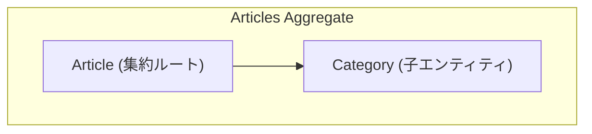
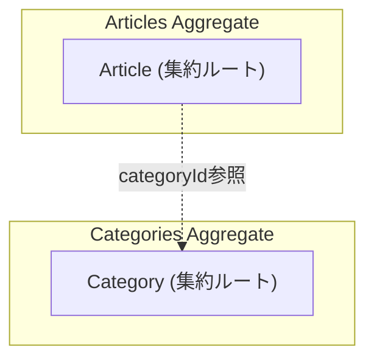

# DDD-006: Category の集約境界が不明確

## 概要

Category が独立した集約なのか、Article 集約の一部なのかが設計上明確でない。リポジトリ構成は独立集約を示唆しているが、ドキュメントは「参照のみ」と記載している。

## 問題箇所

- `docs/domain-model.md:195-198` - Category は「参照のみ」と記載
- `packages/core/articles/repositories/category-*-repository.interface.ts` - 独自リポジトリが存在

## DDDの原則との乖離

`docs/domain-model.md:195-198` では Category が「参照のみ」と記載されているが、実際には:

1. Category は独自のリポジトリ（Command/Query）を持つ
2. CategoryService が Category の生成を担当
3. これらは独立した集約の特徴

設計上の選択肢が明確でない:
- **選択肢1**: Category を Article 集約の一部とする（現在のドキュメントに近い）
- **選択肢2**: Category を独立した集約とする（リポジトリ構成が示唆）

## 影響

- 新規開発者が設計意図を理解しにくい
- トランザクション境界の判断が曖昧
- リファクタリング時の方針決定が困難

## 推奨対応

### 案1: Category を Article 集約の一部として明確化

- Category リポジトリを Article リポジトリに統合
- CategoryService のロジックを ArticleEntity または ArticlesDomainService に移動
- `docs/domain-model.md` を更新

### 案2: Category を独立した集約として明確化

- Category エンティティファクトリを作成（DDD-004 参照）
- `docs/domain-model.md` の図と説明を更新
- Category の不変条件を明確化

### 推奨

**案2** を推奨。理由:
- 既にリポジトリが分離されている
- Category は複数の Article から参照される共有リソース
- 独立した集約として扱うことで、将来的な拡張（Category の属性追加等）に対応しやすい

## 優先度

中

## 関連ファイル

- `docs/domain-model.md`
- `packages/core/articles/repositories/category-command-repository.interface.ts`
- `packages/core/articles/repositories/category-query-repository.interface.ts`
- `packages/core/articles/services/category-service.ts`
